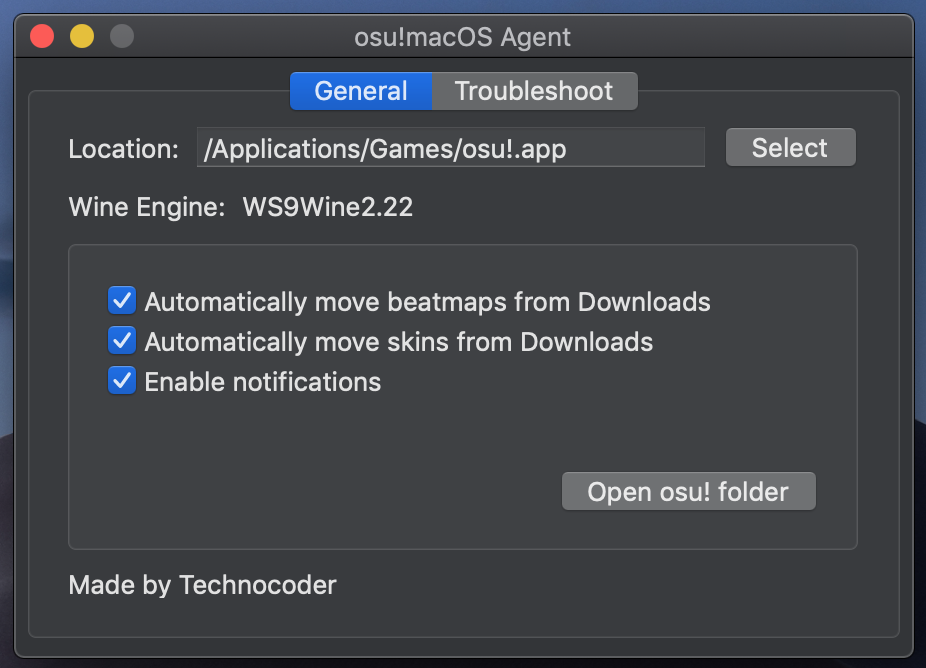
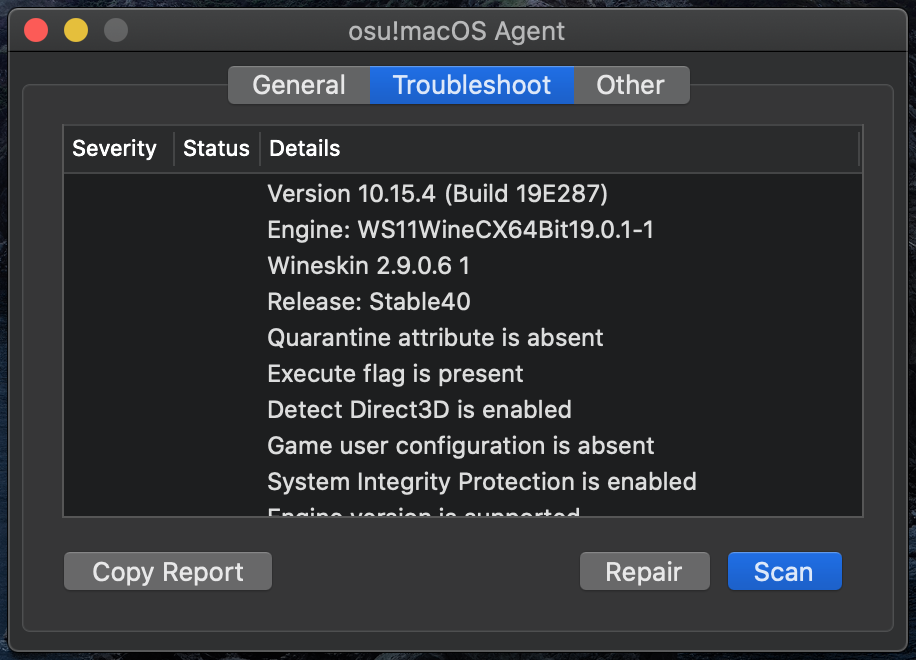

# osu!macOS Agent
An auxiliary troubleshooting tool for osu!



## Features
- Automatically move maps and skins added to the Downloads folder

## Installation
1. Download the application and extract it
2. Right click the application and click `Open`
3. Click `Open`

## Troubleshooting
1. Click the `Scan` button to check for potential issues
2. Click the `Repair` button to fix any identified issues
3. Click the `Copy Report` button to copy a report to the clipboard



### Troubleshooting Passes
Some of the checks that are performed include:
- Compatibility mode
- Wineskin detect Direct3D
- System Integrity Protection
- Engine version
- Log file errors
- Quarantine attribute
- Razer Synapse

The full list of checks is implemented in [this folder](https://github.com/Techno-coder/osu-macOS-Agent/tree/master/osu.macOS.Agent/Passes).

### Sample Report
```
[box=Report]
Version 10.14.6 (Build 18G103)
Engine: WS9Wine2.22
Wineskin 2.6.2
Release: Stable40
Quarantine attribute is absent
Detect Direct3D is disabled
Compatibility mode is disabled
Razer Synapse is absent
System Integrity Protection is enabled
Engine version is supported
[Warning] Errors in: update.log
2019-12-10T05:18:32: _pending\discord-rpc.dll => discord-rpc.dll: FAIL
2019-12-10T05:18:33: _pending\osu!.exe => osu!.exe: FAIL
2019-12-10T05:49:40: _pending\discord-rpc.dll => discord-rpc.dll: FAIL
2019-12-10T05:49:40: _pending\osu!.exe => osu!.exe: FAIL
2019-12-11T11:50:02: osu!.exe: MISMATCH
2019-12-11T11:50:21: _pending\discord-rpc.dll => discord-rpc.dll: FAIL
2019-12-11T11:50:21: _pending\osu!.exe => osu!.exe: FAIL
2019-12-11T11:50:21: _pending\osu!seasonal.dll => osu!seasonal.dll: FAIL
2019-12-11T11:50:21: _pending\osu!ui.dll => osu!ui.dll: FAIL
2019-12-16T11:27:17: _pending\osu!.exe => osu!.exe: FAIL
2019-12-16T11:28:26: _pending\osu!seasonal.dll => osu!seasonal.dll: FAIL
2019-12-16T11:28:26: _pending\osu!ui.dll => osu!ui.dll: FAIL
2019-12-27T09:32:54: osu!.exe: MISMATCH
2019-12-27T09:33:33: _pending\osu!.exe => osu!.exe: FAIL
2019-12-27T09:33:34: _pending\osu!seasonal.dll => osu!seasonal.dll: FAIL
2019-12-27T09:33:34: _pending\osu!ui.dll => osu!ui.dll: FAIL
2020-03-15T04:04:15: bass.dll: MISMATCH
No errors in: runtime.log
[/box]
```

